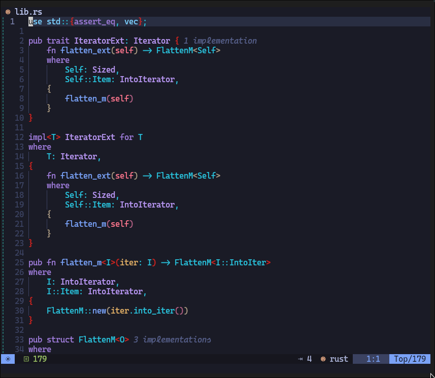
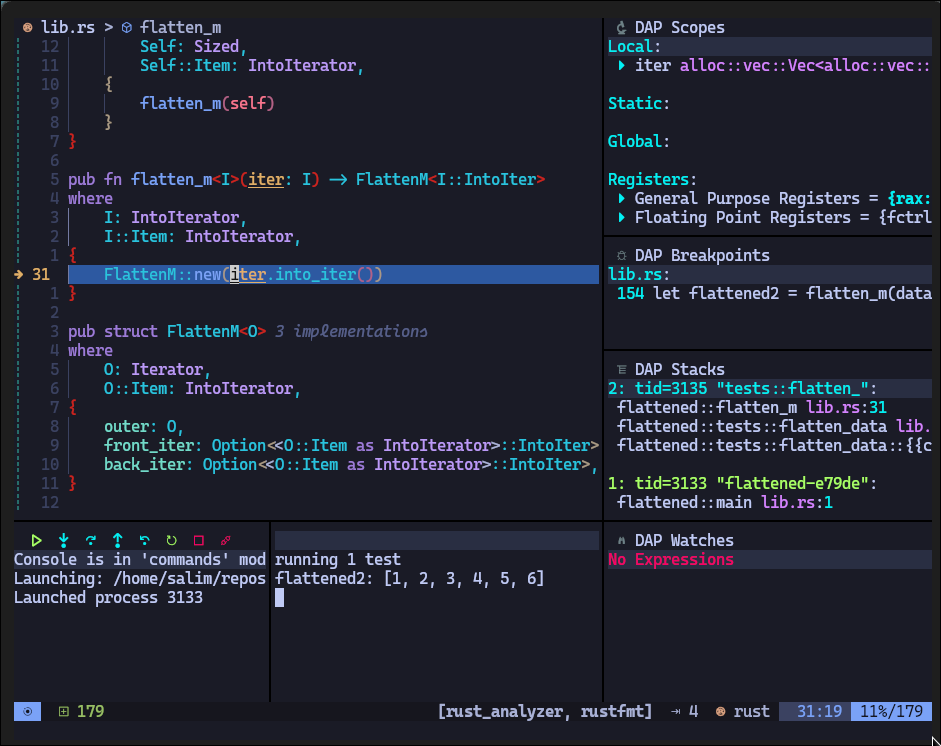

# LEARNING Rust - Learning Rust

<!--toc:start-->

- [LEARNING Rust - Learning Rust](#learning-rust-learning-rust)
  - [Getting Started](#getting-started)
    - [`cargo build`](#cargo-build)
  - [Available Scripts](#available-scripts) - [`cargo run`](#cargo-run) - [`cargo test`](#cargo-test)
  <!--toc:end-->

Learning Rust; from "The Book" and misc. videos

## Getting Started

In the project directory run

### `cargo build`

## Available Scripts

In the project directory, you can run:

### `cargo run`

### `cargo test`
